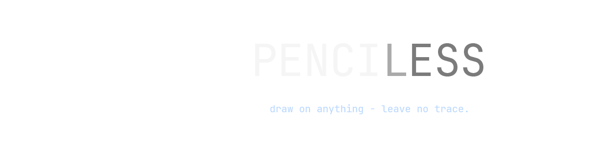

<p align="center">
  
</p>

## Overview

Penciless is a screen annotation overlay for Windows built with Tauri v2 and TypeScript. It sits as a transparent, always-on-top, decoration-less canvas over your entire screen so you can draw on top of anything: presentations, videos, code, whatever's on screen.

---

## Features

- **Pen** › Pressure-simulated freehand strokes via `perfect-freehand`
- **Brush** › Soft, wide brush strokes with smoothing
- **Eraser** › Circular eraser with live cursor preview; independent size from drawing tools
- **Shapes** › Rectangle, circle, diamond, triangle, hexagon, star
- **Color picker** › Full HSV picker with recent colors history and hex input
- **Undo / Redo** › Snapshot-based history (up to 10 steps)
- **Passthrough mode** › `Alt+Shift` toggles mouse passthrough so you can interact with windows underneath
- **Settings** › Theme (dark/light), language (English/Spanish), custom cursor, configurable keyboard shortcuts

---

## Stack

| Layer       | Technology                         |
| ----------- | ---------------------------------- |
| Shell       | Tauri v2 (Rust)                    |
| Frontend    | Vite + TypeScript                  |
| Drawing     | Canvas 2D API + perfect-freehand   |
| Animation   | Motion                             |
| Platform    | Windows (primary)                  |

---

## Architecture

```
src/
├── main.ts          Drawing overlay (transparent fullscreen window)
├── settings.ts      Settings window logic + i18n
├── style.css        Overlay styles
└── settings.css     Settings window styles

src-tauri/
├── src/lib.rs       Tauri commands, tray setup, Alt+Shift monitor
├── icons/           App + tray icons
└── tauri.conf.json  Window config (transparent, alwaysOnTop, skipTaskbar)

index.html           Overlay entry point
settings.html        Settings entry point
```

Two canvases are layered on top of each other:

- **`canvas-bg`** › persistent surface where committed strokes live
- **`canvas-fg`** › live preview layer, cleared after each stroke commits

Settings are stored in `localStorage` and synced to the overlay in real time via Tauri's event bus (`settings-changed`).

---

## Installation

Download the latest installer from the [Releases](https://github.com/joshinyx/penciless/releases) page and run it.

---

## Development

### Prerequisites

- [Node.js](https://nodejs.org/) v18+
- [Rust](https://rustup.rs/) + Cargo
- [Tauri CLI prerequisites for Windows](https://v2.tauri.app/start/prerequisites/)

```bash
git clone https://github.com/joshinyx/penciless.git
cd penciless
npm install

npm run tauri dev    # dev mode with hot reload
npm run tauri build  # production build + NSIS installer
```

---

## Shortcuts

| Action            | Default        |
| ----------------- | -------------- |
| Pen               | `Alt+1`        |
| Brush             | `Alt+2`        |
| Eraser            | `Alt+3`        |
| Shapes            | `Alt+4`        |
| Color picker      | `Alt+5`        |
| Undo              | `Ctrl+Z`       |
| Redo              | `Ctrl+Shift+Z` |
| Clear all         | `Delete`       |
| Toggle passthrough| `Alt+Shift`    |
| Resize tool       | `Ctrl+Scroll`  |

All shortcuts except the last three are configurable from the Settings window.

---

## License

GPL-3.0

## About

Built by [Josh Bernal](https://joshiny.dev).
